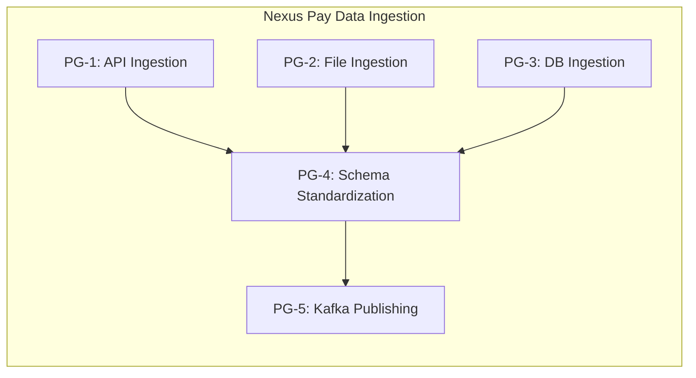
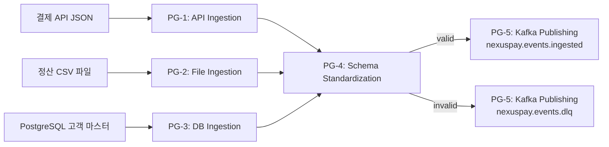
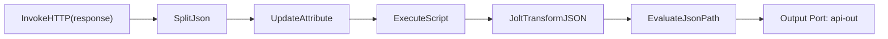
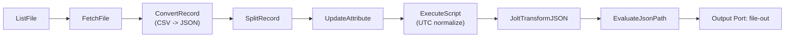
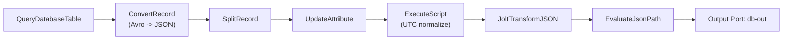
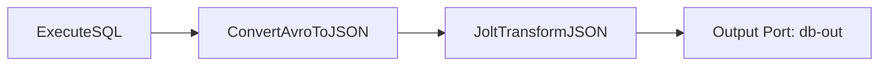
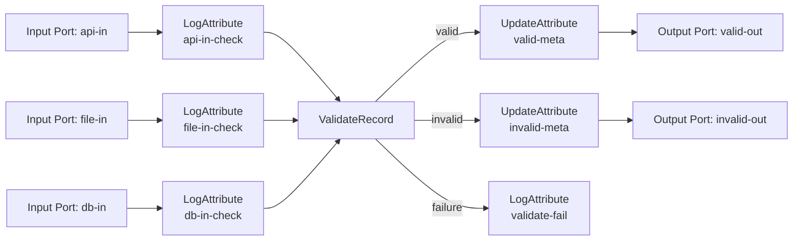
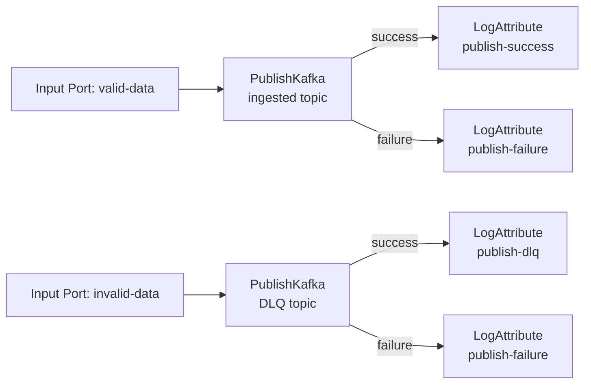

# Nexus Pay NiFi 프로세서 그룹 설계

## 문서 목적

이 문서는 Nexus Pay Week 3에서 NiFi UI로 구현할
다중 소스 수집 파이프라인의 프로세서 그룹 구조를 정의한 설계 문서다.

설계 목표는 다음과 같다.

- REST API, 파일 시스템, PostgreSQL의 이기종 데이터를 하나의 수집 아키텍처로 통합한다.
- 각 소스의 수집 로직과 공통 표준화 로직을 분리해 운영 복잡도를 낮춘다.
- Kafka 전달 전 표준 스키마와 품질 검증을 공통 적용한다.
- Provenance를 통해 데이터 출처와 변환 경로를 추적 가능하게 만든다.

## 고객 요구사항 해석

고객 요구사항은 다음 네 가지로 요약된다.

- 결제 API의 실시간 JSON 수집
- 레거시 정산 시스템의 시간 단위 CSV 수집
- PostgreSQL 고객 마스터 데이터 수집
- 감사 대응을 위한 데이터 출처와 처리 이력 추적

이를 NiFi 설계 관점으로 번역하면 다음과 같다.

- 소스별 수집 그룹을 분리한다.
- 공통 스키마 표준화 단계를 별도로 둔다.
- Kafka 전달 단계를 독립시켜 운영 책임을 분리한다.
- 모든 단계에서 FlowFile Attributes를 충분히 남겨 Provenance 검색성을 높인다.

## 설계 원칙

- 소스별 수집과 공통 후처리를 분리한다.
- 각 Processor는 단일 책임 중심으로 배치한다.
- 그룹 간 연결은 Input Port / Output Port 기반으로 명확히 구분한다.
- Connection에는 Back-Pressure를 설정해 적체 시 상류를 자동 제어한다.
- 오류 데이터는 정상 데이터와 분리해 DLQ 또는 오류 경로로 보낸다.
- 운영자가 NiFi UI만 보고도 어느 단계에서 문제가 생겼는지 판단할 수 있게 한다.

## 핵심 개념 반영

### FlowFile

NiFi에서 처리되는 최소 단위다.
FlowFile은 `Content`와 `Attributes`로 구성된다.

Nexus Pay 기준 예시는 다음과 같다.

- 거래 이벤트 1건
- 정산 CSV 파일 1개
- API 응답 1회

설계 반영 사항:

- 소스 식별용 `source_system`, `data_source`
- 추적용 `event_id`, `record_id`, `filename`
- 감사 대응용 `ingested_at`, `correlation_id`

같은 메타데이터를 Attributes로 유지하도록 설계한다.

### Processor

Processor는 FlowFile을 생성, 변환, 전달하는 작업 단위다.
이번 설계에서 사용하는 핵심 프로세서는 다음과 같다.

- `InvokeHTTP`: REST API 호출
- `ListFile` / `FetchFile`: 파일 시스템 감시 및 수집
- `ExecuteSQL` / `QueryDatabaseTable`: DB 조회 및 증분 수집
- `JoltTransformJSON`: JSON 스키마 변환
- `PublishKafka`: Kafka 토픽 전송
- `RouteOnAttribute` / `RouteOnContent`: 조건부 라우팅

### Connection과 Back-Pressure

Connection은 프로세서 간 큐 역할을 한다.
Back-Pressure 임계값을 설정하면 큐가 가득 찰 때 상류 Processor가 자동 일시 정지한다.

설계 반영 사항:

- 모든 그룹 간 경계 Connection에 적정 Back-Pressure 설정
- Kafka 장애 시 수집 그룹이 무한 적체되지 않도록 보호
- 운영자가 어느 지점에서 병목이 생겼는지 큐 길이로 판단 가능

### Process Group

Process Group은 복수의 프로세서를 논리 단위로 묶는 컨테이너다.
소스별, 기능별로 그룹을 나눠 복잡도를 관리한다.

### Provenance

모든 FlowFile의 생성, 변환, 전달 이력을 기록하는 감사 로그다.
금융감독원 감사 대응을 위해 필수적인 추적 수단이다.

설계 반영 사항:

- 각 소스 그룹에서 출처 메타데이터를 명확히 부여
- 표준화 단계에서 공통 식별자를 유지
- Kafka 전송 전까지 FlowFile 계보가 끊기지 않도록 구성

## 최상위 아키텍처

최상위 그룹 이름은 다음과 같이 정의한다.

- `Nexus Pay Data Ingestion`

하위 프로세서 그룹은 5개로 구성한다.

- `PG-1: API Ingestion`
- `PG-2: File Ingestion`
- `PG-3: DB Ingestion`
- `PG-4: Schema Standardization`
- `PG-5: Kafka Publishing`

전체 관계는 다음과 같다.



```text
+------------------------------------------------------+
|              Nexus Pay Data Ingestion                |
+------------------------------------------------------+
|  PG-1: API Ingestion                                 |
|  PG-2: File Ingestion                                |
|  PG-3: DB Ingestion                                  |
|  PG-4: Schema Standardization                        |
|  PG-5: Kafka Publishing                              |
+------------------------------------------------------+

PG-1 --------------------+
PG-2 --------------------+--> PG-4 --> PG-5
PG-3 --------------------+
```

즉 `PG-1`, `PG-2`, `PG-3`은 서로 독립적인 입력 계층이고,
`PG-4`는 공통 표준화 및 검증 계층,
`PG-5`는 최종 Kafka 전달 계층이다.

좀 더 상세한 흐름은 다음과 같다.



```text
[결제 API JSON] ------------> [PG-1: API Ingestion] ----+
                                                         |
[정산 CSV 파일] ------------> [PG-2: File Ingestion] ---+--> [PG-4: Schema Standardization]
                                                         |         |
[PostgreSQL 고객 마스터] --> [PG-3: DB Ingestion] ------+         +--> valid   --> [PG-5] --> [nexuspay.events.ingested]
                                                                   |
                                                                   +--> invalid --> [PG-5] --> [nexuspay.events.dlq]
```

## 그룹별 상세 설계

### PG-1: API Ingestion

목적:
- 결제 API에서 최신 거래 이벤트를 주기적으로 수집한다.

입력:
- 외부 결제 API 응답 JSON

출력:
- 건별 분리 및 1차 변환이 완료된 FlowFile을 `PG-4`로 전달

권장 프로세서 체인:



```text
[InvokeHTTP(response)]
   |
   v
[SplitJson]
   |
   v
[UpdateAttribute]
   |
   v
[ExecuteScript]
   |
   v
[JoltTransformJSON]
   |
   v
[EvaluateJsonPath]
   |
   v
[Output Port: api-out]
```

주요 Attribute:

- `source_system=nexuspay-payment-api`
- `data_source=payment-api`
- `api_endpoint=/api/v1/payments/recent`
- `ingested_at`

설계 포인트:

- 응답 실패는 별도 실패 경로로 분리한다.
- `InvokeHTTP` 성공 응답 본문은 `response` relationship에서 후속 처리한다.
- JSON 배열 응답은 `SplitJson`으로 건별 처리한다.
- `UpdateAttribute`에서 수집 시각과 소스 시스템 값을 만든다.
- `ExecuteScript`는 원본 API 필드 `timestamp`를 Jolt 전에 UTC ISO-8601 형식으로 정규화한다.
- `JoltTransformJSON` 뒤 공통 `EvaluateJsonPath`에서 `event_id`, `event_type`, `event_timestamp`, `data_source`, `source_system`를 attribute로 추출한다.

### PG-2: File Ingestion

목적:
- 정산 시스템이 생성한 CSV 파일을 자동 수집한다.

입력:
- 파일 시스템 또는 공유 경로의 CSV 파일

출력:
- JSON 레코드로 변환된 FlowFile을 `PG-4`로 전달

권장 프로세서 체인:



```text
[ListFile]
   |
   v
[FetchFile]
   |
   v
[ConvertRecord: CSV -> JSON]
   |
   v
[SplitRecord]
   |
   v
[UpdateAttribute]
   |
   v
[ExecuteScript: UTC normalize]
   |
   v
[JoltTransformJSON]
   |
   v
[EvaluateJsonPath]
   |
   v
[Output Port: file-out]
```

주요 Attribute:

- `source_system=nexuspay-settlement-file`
- `data_source=settlement-csv`
- `filename`
- `ingested_at`
- `settlement_date.normalized=true`
- `script_file=/opt/nifi/custom-config/scripts/normalize-settlement-event-timestamp.groovy`

설계 포인트:

- `ListFile + FetchFile` 패턴으로 파일 감지와 읽기를 분리한다.
- `ExecuteScript`는 원본 필드 `settlement_date`를 Jolt 전에 UTC ISO-8601 형식으로 정규화한다.
- `JoltTransformJSON` 뒤 공통 `EvaluateJsonPath`에서 `event_id`, `event_type`, `event_timestamp`, `data_source`, `source_system`를 attribute로 추출한다.
- 중복 파일 처리 방지와 상태 관리를 쉽게 한다.
- 처리 완료 파일은 `processed/` 경로 이동 또는 별도 보관 정책을 둔다.

### PG-3: DB Ingestion

목적:
- PostgreSQL 고객 마스터 데이터를 증분 방식으로 수집한다.

입력:
- PostgreSQL `customers` 테이블

출력:
- 표준화 가능한 JSON 구조의 FlowFile을 `PG-4`로 전달

권장 프로세서 체인:



```text
[QueryDatabaseTable]
   |
   v
[ConvertRecord: Avro -> JSON]
   |
   v
[SplitRecord]
   |
   v
[UpdateAttribute]
   |
   v
[ExecuteScript: UTC normalize]
   |
   v
[JoltTransformJSON]
   |
   v
[EvaluateJsonPath]
   |
   v
[Output Port: db-out]
```

대안 체인:



```text
[ExecuteSQL]
   |
   v
[ConvertAvroToJSON]
   |
   v
[JoltTransformJSON]
   |
   v
[Output Port: db-out]
```

주요 Attribute:

- `source_system=nexuspay-customer-db`
- `data_source=customer-db`
- `table_name=customers`
- `incremental_column=updated_at`
- `ingested_at`
- `event_timestamp.normalized=true`

설계 포인트:

- `updated_at` 같은 컬럼을 기준으로 증분 수집한다.
- `SplitRecord` 뒤 `UpdateAttribute`에서 `ingested_at`, `source_system`를 추가한다.
- `ExecuteScript`는 원본 필드 `updated_at`를 Jolt 전에 UTC ISO-8601 형식으로 정규화한다.
- `JoltTransformJSON` 뒤 공통 `EvaluateJsonPath`에서 `event_id`, `event_type`, `event_timestamp`, `data_source`, `source_system`를 attribute로 추출한다.
- 전체 테이블 재조회보다 증분 수집을 우선 설계한다.
- 고객 마스터는 이벤트성 데이터가 아니라 기준정보라는 점을 명확히 구분한다.

### PG-4: Schema Standardization

목적:
- 세 소스에서 들어온 데이터를 공통 이벤트 스키마로 통합하고 품질을 검증한다.

입력:
- `PG-1`, `PG-2`, `PG-3`의 Output Port

출력:
- 정상 데이터는 `PG-5`로 전달
- 비정상 데이터는 DLQ 또는 오류 경로로 전달

권장 프로세서 체인:



```text
[Input Port: api-in] -----> [LogAttribute: api-in-check] ---+
                                                            |
[Input Port: file-in] ----> [LogAttribute: file-in-check] --+--> [ValidateRecord] --> valid   --> [UpdateAttribute: valid-meta] --> [Output Port: valid-out]
                                                            |                     |
[Input Port: db-in] ------> [LogAttribute: db-in-check] ---+                     +--> invalid --> [UpdateAttribute: invalid-meta] -> [Output Port: invalid-out]
                                                                                  |
                                                                                  +--> failure --> [LogAttribute: validate-fail]
```

주요 Attribute:

- `standard_schema_version`
- `validation_status`
- `kafka.topic`
- `kafka.key`
- `source_system`

설계 포인트:

- 공통 스키마 계약은 이 그룹에서 강제한다.
- `RouteOnAttribute` 없이 `ValidateRecord`의 `valid`, `invalid`, `failure` relationship를 직접 사용한다.
- 정상/비정상 흐름을 명확히 분기해 downstream 오염을 막는다.
- `kafka.key=${event_id}`, `nifi.source.group=${source_system}` 같은 공통 메타데이터를 이 그룹에서 부여한다.

### PG-5: Kafka Publishing

목적:
- 표준화가 끝난 데이터를 Kafka로 전달한다.

입력:
- `PG-4`의 `valid-out`, `invalid-out`

출력:
- Kafka 정상 토픽
- Kafka DLQ 토픽

권장 프로세서 체인:



```text
[Input Port: valid-data] -----> [PublishKafka: ingested topic] -----> success --> [LogAttribute: publish-success]
                                                    |
                                                    +--> failure --> [LogAttribute: publish-failure]

[Input Port: invalid-data] ---> [PublishKafka: DLQ topic] ----------> success --> [LogAttribute: publish-dlq]
                                                    |
                                                    +--> failure --> [LogAttribute: publish-failure]
```

주요 Attribute:

- `kafka.topic`
- `kafka.key`
- `publish_time`
- `delivery_status`

설계 포인트:

- 정상 데이터와 불량 데이터를 서로 다른 토픽으로 분리한다.
- 메시지 키는 파티셔닝 전략과 후속 소비 특성에 맞춰 지정한다.
- Kafka 전송 실패 시 재시도 정책 또는 별도 오류 경로를 둔다.

## 그룹 간 연결 설계

연결 구조는 다음과 같이 정의한다.

- `PG-1 Output Port [api-out] -> PG-4 Input Port [api-in]`
- `PG-2 Output Port [file-out] -> PG-4 Input Port [file-in]`
- `PG-3 Output Port [db-out] -> PG-4 Input Port [db-in]`
- `PG-4 Output Port [valid-out] -> PG-5 Input Port [valid-data]`
- `PG-4 Output Port [invalid-out] -> PG-5 Input Port [invalid-data]`

이 구조를 사용하는 이유는 다음과 같다.

- 소스별 변경 영향이 다른 그룹에 직접 퍼지지 않는다.
- 공통 검증과 전달 단계를 재사용할 수 있다.
- 장애가 발생했을 때 어느 레이어에서 문제가 생겼는지 쉽게 좁힐 수 있다.

## Connection 및 Back-Pressure 기준

권장 기준 예시는 다음과 같다.

| 구간 | FlowFile 수 | 데이터 크기 | 목적 |
|------|-------------|-------------|------|
| 소스 그룹 내부 | 10,000 | 1 GB | 일시적 입력 급증 완충 |
| 소스 그룹 -> PG-4 | 20,000 | 2 GB | 표준화 단계 병목 보호 |
| PG-4 -> PG-5 | 20,000 | 2 GB | Kafka 지연 시 상류 보호 |
| 오류 경로 | 5,000 | 500 MB | 오류 데이터 과적체 방지 |

설계 원칙:

- 수집 속도가 빠른 구간일수록 완충 여유를 둔다.
- DLQ 경로도 별도 Back-Pressure를 둔다.
- Kafka 장애 시 무한 적체를 막아야 한다.

## Provenance 및 감사 추적 설계

감사 대응을 위해 다음 정보가 검색 가능해야 한다.

- 이 데이터는 어느 소스에서 왔는가
- 언제 수집되었는가
- 어떤 변환을 거쳤는가
- 왜 정상 토픽 또는 DLQ 토픽으로 갔는가

이를 위해 다음 원칙을 적용한다.

- 각 소스 그룹에서 `source_system`, `data_source`, `ingested_at`을 기록한다.
- 가능한 경우 `event_id`, `record_id`, `customer_id`, `filename`을 Attributes로 유지한다.
- 표준화 단계 이후에도 원천 식별 정보를 제거하지 않는다.
- Kafka 전송 직전 `kafka.topic`, `kafka.key`를 Attributes로 남긴다.

예시 추적 시나리오:

- `PAY-00000042` 검색
- `CREATE` 이벤트에서 API 유입 시각 확인
- `CONTENT_MODIFIED`에서 Jolt 변환 이력 확인
- `ROUTE`에서 valid/invalid 분기 확인
- `SEND`에서 Kafka 전송 토픽과 시각 확인

## 운영 관점의 기대 효과

- 소스별 수집 장애를 독립적으로 대응할 수 있다.
- 공통 스키마 검증을 한 곳에서 관리할 수 있다.
- Kafka 장애 시 Back-Pressure로 상류를 보호할 수 있다.
- 고객과 운영자가 NiFi UI만 보고 전체 흐름을 이해할 수 있다.
- Provenance를 통해 금융감독원 감사 대응 자료를 준비할 수 있다.

## 구현 우선순위

Week 3 진행 순서는 다음과 같이 가져간다.

1. `PG-1: API Ingestion` 구현
2. `PG-2: File Ingestion` 구현
3. `PG-3: DB Ingestion` 구현
4. `PG-4: Schema Standardization` 구현
5. `PG-5: Kafka Publishing` 구현

이 순서는 소스별 수집을 먼저 완성한 뒤
공통 표준화와 Kafka 전달을 붙이는 방식으로,
문제 발생 시 디버깅 범위를 가장 좁히기 쉽다.
